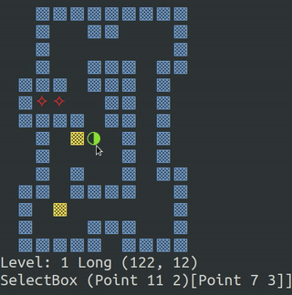

# Sokoban game

The goal is to build flexible testable model of the game, and make IO layer as thin as possible.

Also the game should implement advanced move-ability control with reachability test, and such algorithms 
are usually hard to implement in Haskell. This project has it implemented using
**mutable** data structures, see [`Solver.hs`](src/Sokoban/Solver.hs) module. (Currently the data structures are copied from [impure-containers](https://hackage.haskell.org/package/impure-containers)).



### Installation and run
                        
You need to have [Stack](https://docs.haskellstack.org/en/stable/) installed.

```
stack build
stack exec sokoban
```

### Requests for the improvement. 

1. ☑ Track `steps` and `pushes`.
1. ☑ Implement mouse events and reaction on `MoveBox Point Point`, `MoveWorker Point`
    (this is pretty hard, since it requires path finding algorithm implemented for with
    pushes or steps optimization).
1. ☑ Parse command line options with `optparse-applicative`.
1. ☑ Implement animations.
1. ⍻ Replays and stored solutions.

### The notes abount animation

The notes are put [here](animation.md).


### Where to get sokoban levels

- http://www.sourcecode.se/sokoban/levels
- https://sokoban-jd.blogspot.com/p/all-my-sokoban-collections.html
- https://sokoban-game.com/packs
- http://www.sneezingtiger.com/sokoban/levels.html

### Info on sokoban solvers

- http://sokobano.de/wiki/index.php?title=Solver Information on existing solvers and the challenges
- https://www.sokoban-online.de/ JSoko home, the feature rich java implementation


### Haskell on SO

- https://stackoverflow.com/questions/51874362/combine-st-and-list-monads-in-haskell
- https://stackoverflow.com/questions/11662696/haskell-map-runst
- https://stackoverflow.com/questions/12468622/how-does-the-st-monad-work
- https://stackoverflow.com/questions/9468963/runst-and-function-composition
- https://stackoverflow.com/questions/48727762/what-is-an-elegant-idiom-for-a-lexicographic-ord-instance
- https://stackoverflow.com/questions/3651144/comparing-lists-in-haskell-or-more-specifically-what-is-lexicographical-order
- https://stackoverflow.com/questions/38629806/get-the-minimum-value
- https://stackoverflow.com/questions/18006845/function-in-haskell-that-like-catmaybes-but-having-type-maybe-a-maybe-a
- https://stackoverflow.com/questions/27399696/filter-positions-in-a-list-haskell


### Useful information

- [How to get MouseMove and MouseClick in bash](https://stackoverflow.com/a/5970472/5066426)
- [Simple XLib program to highlight the cursor position](https://github.com/arp242/find-cursor)
- [Handling Control-C in Haskell](https://neilmitchell.blogspot.com/2015/05/handling-control-c-in-haskell.html?m=1)
- [STMonadTrans](https://hackage.haskell.org/package/STMonadTrans) A monad transformer version of the ST monad
- [Sokolution author's thoughts](http://sokobano.de/wiki/index.php?title=Sokoban_solver_%22scribbles%22_by_Florent_Diedler_about_the_Sokolution_solver)
- [Mutable hashtables library](https://hackage.haskell.org/package/hashtables-1.2.3.4) and its author announcing it

- Unicode symbols to try for walls, goals, boxes and worker:

```
⬛ ■ ◼ ◾ ▪ □ ⬚ ▫ ◻ ❎ ⬛ ⬜ ▢ ▣ ◽ ❑ ❒ ❏ ❐ ▩ ▦ ▧ ▨ ⊞ ⊡ ☒
⊕ ⊗ ✪ ⊙ ⦾ ⦿ ⊚ ⊛ ○ ◌ ● ◯ ⬤ ⌾ ⍟ ⨯ ⁘
🦄

U  ▲ △ ⬆ ⇧ ◩ ◓ ◒
D  ▼ ▽ ⬇ ⇩ ◪ ◒ ◓
L  ◀ ◁ ⬅ ⇦ ⬕ ◐ ◑
R  ▶ ▷ ➡ ⇨ ⬔ ◑ ◐
```


```haskell

moveBoxesByWorker :: MonadState GameState m => [Point] -> [Point] -> m ()
moveBoxesByWorker src dst = do
  dirs <-
    case (src, dst) of
      ([s], [t]) -> do
        erasedGs <- gets $ eraseBoxes [s]
        -- erase source box not to break path finding and avoid spoiling of the current gs
        let (dirs, _dbgGs) = runState (tryMove1Box s t) erasedGs
        -- viewState . message .= (dbgGs ^. viewState . message)
        -- viewState . doClearScreen .= True
        return dirs
      ([s1, s2], [t1, t2]) -> do
        erasedGs <- gets $ eraseBoxes [s1, s2]
        let (dirs, _dbgGs) = runState (tryMove2Boxes [s1, s2] [t1, t2]) erasedGs
        -- viewState . message .= (dbgGs ^. viewState . message)
        -- viewState . doClearScreen .= True
        return dirs
      _ -> return []
  diffs' <- sequenceA <$> mapM doMove dirs
  case diffs' of
    Nothing -> return ()
    Just [] -> return ()
    Just diffs -> do
      ls <- use levelState
      let uidx = ls ^. undoIndex
      levelState . undoStack .= UndoItem diffs : drop uidx (ls ^. undoStack)
      levelState . undoIndex .= 0
      viewState . animateRequired .= True
      viewState . animationMode .= AnimationDo
  where
    tryMove1Box :: MonadState GameState m => Point -> Point -> m [Direction]
    tryMove1Box s t = do
      srcs <- findBoxDirections s
      gs <- get
      let m = gs ^. levelState . height
      let n = gs ^. levelState . width
      paths <-
        forM srcs $ \src ->
          return $ runST $ do
            let dst = PD t D []
            hm <- HM.new
            let ctx = SolverContext hm m n
            pushSolver <- buildPushSolver ctx dst
            path <- flip evalStateT gs $ aStarFind pushSolver src
            return $ pushPathToDirections path
      let nePaths = filter (not . null) paths
      let selected =
            if null nePaths
              then []
              else minimumBy (comparing length) nePaths
      return selected
    tryMove2Boxes :: MonadState GameState m => [Point] -> [Point] -> m [Direction]
    tryMove2Boxes _ss _ts = return []

```